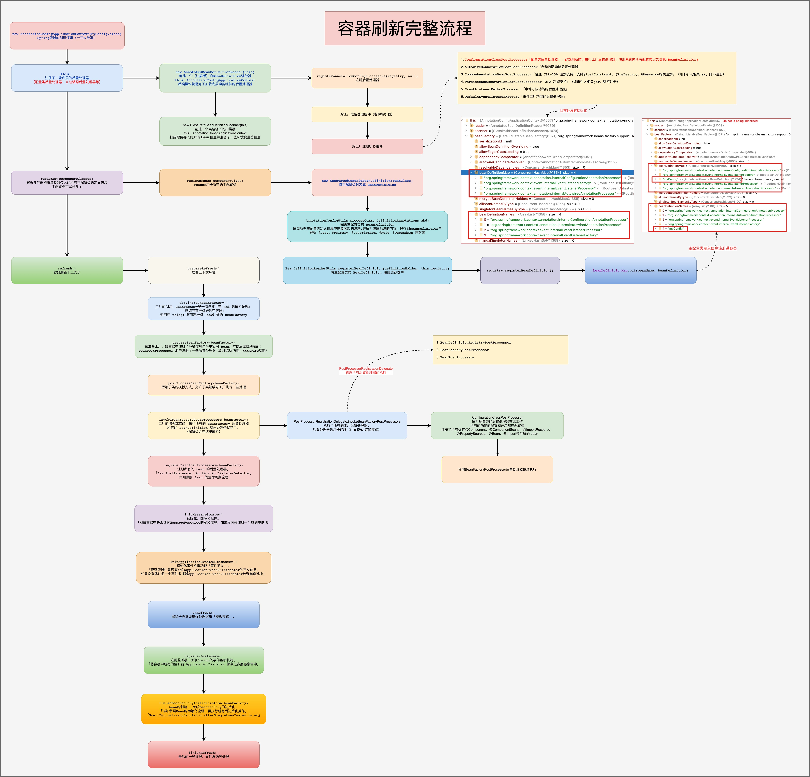
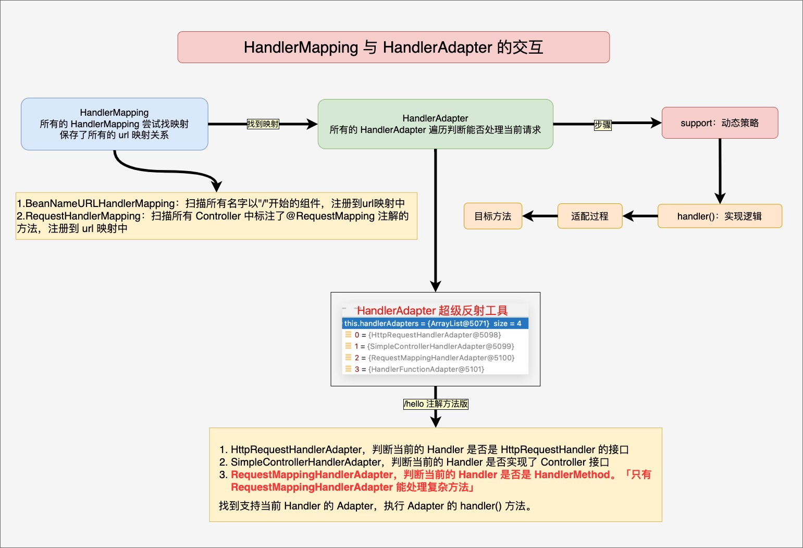

#  Spring Framework 

---

## Spring 整体架构

#### Spring 如何工作
Spring 暴露给程序员的使用方式是，要么写一个 xml 文件、要么使用注解、要么利用磁盘文件、网络文件等，把需要的功能定义出来，这个信息最终会生成一个组件或者功能配置清单，Spring 会去读取并解析这些功能清单，这些信息就会决定 Spring 框架中的各种行为。

#### Spring 整体架构流程
在 Spring 的底层把所有的资源（xml、注解、网络文件、磁盘文件等）都用 Resource 来表示，Spring 使用 ResourceLoader（资源加载器）加载这些资源，交给 BeanDefinitionReader 来读取和解析，并存放到 Spring 工厂的 BeanDefinitionRegistry （Bean  定义信息注册中心）中，即 Spring 一启动，就将所有资源解析成 BeanDefinition 存入到 BeanDefinitionRegistry 中。（实际是保存在一个 map 中，BeanDefinitionMap），然后 Spring 将这些 bean 的定义信息挨个创建成对象，并存入到 IOC 容器中，Spring 中使用各种池来存储对象，其中单例对象池用于保存所有的单例对象，在使用对象时，就去单例池中获取对象。

```text
ApplicationContext 和 BeanFactory 的作用：
1.BeanFactory 定义工厂创建和获取 Bean 流程的
2.ApplicationContext 定义了 Bean 的增强处理以及容器保存等各种流程
3.ApplicationContext 里面第一次要用到 bean，会使用工厂 BeanFactory 先来创建，创建好后保存在容器中

AOP：
1.AnnotationAspectJAutoProxyCreator 后置处理器，会在启动的时候分析所有标注了 @Aspect 注解的切面信息，将其封装成增强器链，并为目标对象创建代理放在容器中
2.执行期间代理对象会链式调用 AOP 切面定义的增强方法

生命周期：
1.BeanFactoryPostProcessor：在 BeanFactory 初始化前后拦截
2.BeanPostProcessor：在所有组件创建对象及初始化前后拦截
3.InitializingBean：组件单独实现它，可以在组件赋值结束以后调用初始化进行增强处理
4.SmartInitializingBean：所有组件都创建好以后，每个组件再来 SmartInitializingBean

Bean：保存 BeanDefinition 信息→根据 BeanDefinition 信息创建对象→赋值→初始化

Bean的功能增强全都是由 BeanPostProcessor + InitializingBean (合起来)完成的。
使用建议：
1.所有组件可能都会使用的功能，使用后置处理器BeanPostProcessor来实现
2.单组件增强的功能，最好使用生命周期InitializingBean来实现。

新功能分析思路
1.组件的新功能一般都是由Bean的生命周期机制增强出来的
2.这个新功能加入了哪些组件，这些组件在生命周期期间做了什么

Spring的套路点
1.AbstractBeanDefinition 如何给容器中注入了什么组件
2.BeanFactory 初始化完成后，监控其中多了哪些后置处理器
3.分析后置处理器什么时候调用，做了什么功能。
以上所有的前提，是理解容器刷新12大步与getBean流程，防止混乱
a.工厂后置处理器执行
b.bean后置处理器执行、bean的生命周期（后置处理器+InitializingBean）
```
---
#### Spring架构原理图


---
#### 容器刷新完整流程
Spring 容器启动时，先加载一些底层的后置处理器（例如ConfigurationClassPostProcessor「配置类后置处理器」，容器刷新时，执行工厂后置处理器，注册系统内所有配置类定义信息、AutowiredAnnotationBeanPostProcessor「自动装配功能后置处理器」……），然后再将由构造传入的所有主配置类的定义信息注册进容器。然后开始刷新容器的步骤（容器刷新十二大步）。
1. prepareRefresh()：准备上下文环境；
2. obtainFreshBeanFactory()：工厂的创建，BeanFactory第一次创建「有 xml 的解析逻辑」，获取当前准备好的空容器，返回在 this() 环节就准备（new）好的 BeanFactory；
3. prepareBeanFactory(beanFactory)：预准备工厂，给容器中注册了环境信息作为单实例 Bean，方便后续自动装配；beanPostProcessor 池中注册了一些后置处理器（处理监听功能、XXXAware功能）；
4. postProcessBeanFactory(beanFactory)：留给子类的模板方法，允许子类继续对工厂执行一些处理；
5. invokeBeanFactoryPostProcessors(beanFactory)：工厂的增强或修改：执行所有的 BeanFactory 后置处理器，所有的 BeanDefinition 就已经准备就绪了（配置类会在这里解析，注册了所有标有@Component、@ComponentScans、@ImportResource、@PropertySources、@Bean、@Import等注解的 bean）；
6. registerBeanPostProcessors(beanFactory)：注册所有的 bean 的后置处理器。BeanPostProcessor、ApplicationListenerDetector详细参照 Bean 的生命周期流程；
7. initMessageSource()：初始化，国际化组件。观察容器中是否含有MessageResource的定义信息，如果没有就注册一个放到单例池；
8. initApplicationEventMulticaster()：初始化事件多播功能「事件派发」。观察容器中是否有id为applicationEventMulticaster的定义信息，如果没有就注册一个事件多播器ApplicationEventMulticaster放到单例池中；
9. onRefresh()：留给子类继续增强处理逻辑「模板模式」；
10. registerListeners()：注册监听器，关联Spring的事件监听机制。将容器中所有的监听器 ApplicationListener 保存进多播器集合中；
11. finishBeanFactoryInitialization(beanFactory)：bean的创建，完成BeanFactory的初始化。详细参照Bean的初始化流程，再执行所有后初始化操作「SmartInitializingSingleton.afterSingletonsInstantiated」；
12. finishRefresh()：最后的一些清理、事件发送等处理。


---
#### Bean的初始化流程


---
#### Bean生命周期


---
#### 循环引用


---
#### AOP增强流程


---
#### AOP执行链执行流程
```
目标方法的执行
容器中保存了组件的代理对象「cglib增强后的对象」，这个对象里面保存了详细信息（比如增强器、目标对象等）

1. CglibAopProxy.intercept(),拦截目标方法的执行
2. 根据ProxyFactory对象获取将要执行的目标方法的拦截器链
   List<Object> chain = this.advised.getInterceptorsAndDynamicInterceptionAdvice(method, targetClass);
   1. List<Object> interceptorList：保存所有的拦截器，一个默认的ExposeInvocationInterceptor和四个增强器「通知方法」
   2. 遍历所有的增强器，将其转换成 Interceptor：MethodInterceptor[] interceptors = registry.getInterceptors(advisor)
   3. 将增强器转为 List<MethodInterceptor>
      1. 如果是 MethodInterceptor ，直接加入到集合中
      2. 如果不是 MethodInterceptor，则使用 AdvisorAdapter 将增强器转为 MethodInterceptor，转换完成后，返回 MethodInterceptor 数组。
3. 如果没有拦截器链，则直接执行目标方法
   拦截器链：每一个通知方法又被包装成方法拦截器，利用 MethodInterceptor 拦截器机制执行
4. 如果有拦截器链，把需要执行的目标对象、目标方法、拦截器链等信息传入创建的CglibMethodInvokation对象，并调用Object retVal = mi.procceed()
5. 拦截器链的触发过程
   1. 如果没有拦截器或者拦截器索引和拦截器数组-1的大小相同（指定到了最后一个拦截器），则执行目标方法
   2. 链式获取每一个拦截器，拦截器执行 invoke() 方法，每一个拦截器等待下一个拦截器执行完成返回以后再执行
      拦截器链的机制，保证通知方法和目标方法的执行顺序
      
AOP 总结：
1. @EnableAspectJAutoProxy 开启基于注解的 AOP 功能
2. @EnableAspectJAutoProxy 会给容器中注册一个组件 AnnotationAwareAspectJAutoProxyCreator，是一个后置处理器
3. 容器的创建流程
   1. registerBeanPostProcessors(beanFactory) 注册后置处理器，创建 AnnotationAwareAspectJAutoProxyCreator 对象
   2. finishBeanFactoryInitialization(beanFactory) 初始化剩下的单实例 Bean
      1. 创建业务逻辑组件和切面组件
      2. AnnotationAwareAspectJAutoProxyCreator 拦截组件的创建过程
      3. 组件创建完成后，判断组件是否需要增强
         需要增强：将切面的通知方法，包装成增强器（Advisor），给业务逻辑组件创建一个代理对象（反射cglib）
4. 执行目标方法
   1. 代理对象执行目标方法
   2. CglibAopProxy.intercept()
      1. 得到目标方法的拦截器链（增强器包装成拦截器 MethodInterceptor ）
      2. 利用拦截器的链式机制，依次进入每一个拦截器进行执行；
      3. 效果（Spring 5.0）
         正常执行：前置通知→目标方法→返回通知→后置通知
         异常执行：前置通知→目标方法→异常通知→后置通知
```


---
#### Spring 监听器原理


---
MVC 整体架构
---

---
#### MVC启动原理


---
#### MVC启动过程
引入的 spring-web 的类路径（/spring-web/src/main/resources/META-INF/services/javax.servlet.ServletContainerInitializer）下指定了 Servlet 规范的实现类（org.springframework.web.SpringServletContainerInitializer），Servlet 规范规定，ServletContainerInitializer 这个接口的实现类负责处理 @HandleTypes 注解，这个接口的所有实现类是由 Tomcat 使用 SPI 机制加载的。

Tomcat 启动时利用 SPI 机制加载，扫描所有实现了 WebApplicationInitializer 接口的实现类，调用这些实现类的 onStartup() 方法完成了下面两件事：
1. 创建了一个空的 IOC 容器（根容器/父容器），利用根容器创建一个监听器，并保存进 Tomcat 中，容器此时没有刷新；当 Tomcat 加载完 web 应用后，会触发监听器钩子回调 contextInitialized() 方法，来初始化刷新根容器，此时所有的业务逻辑组件功能AOP，事务，IOC，自动装配，HelloService创建对像……
2. 创建了一个空的 web-ioc 容器（子容器），利用这个 web-ioc 容器创建 DispatcherServlet 对象，此时 DispatcherServlet 中保存了 web-ioc 容器；DispatcherServlet 继承自 GenericServlet，GenericServlet 有初始化方法 init()，当 Tomcat加载完 web 应用后，会初始化DispatcherServlet，即会触发 GenericServlet 子类的初始化模板方法，就会执行 FrameworkServlet 的 initWebApplicationContext() 方法来初始化刷新 web-ioc 容器，期间 web-ioc.setParent(IOC容器)，形成父子容器，子容器刷新，此时 Controller 才开始创建对象，并自动装配 Service（如过当前容器中没有，要去父容器中找）。

即 MVC 容器的刷新基于两种方式
1. 监听器回调；
2. 初始化回调。


---
#### MVC请求处理流程
1. 用户发送请求至前端控制器 「DispatcherServlet」
2. 前端控制器 「DispatcherServlet」 收到请求，调用处理器映射器「HandlerMapping」，返回处理器执行链「HandlerExecutionChain」，执行链包含目标方法以及所有的拦截器
3. 前端控制器 「DispatcherServlet」 根据处理器执行链，遍历所有的处理器适配器「HandlerAdapter」，获取能够支持当前处理器的适配器
4. 处理器适配器「HandlerAdapter」调用处理器「Controller」执行目标方法，将返回值封装成模型视图「 ModelAndView」，并返回给前端控制器 「DispatcherServlet」
5. 前端控制器 「DispatcherServlet」将模型视图「 ModelAndView」传给视图解析器「ViewResolver」进行解析，返回视图「View」对象
6. 前端控制器 「DispatcherServlet」根据视图对象进行渲染，即将模型数据填充至视图中，并向用户展示。

浏览器发起请求，带有应用名称和请求路径，会被 DispatcherServlet 的 doDispatcher() 方法接收并处理；
1. 文件上传预处理
2. getHandler(processedRequest)：返回 handler 的执行链，包括目标方法和所有的拦截器
3. getHandlerAdapter()：寻找适配器，HandlerAdapter 是超级反射工具
4. mappedHandler.applyPreHandle()：拦截器**前置拦截**过程 preHandle
5. ha.handle()：目标方法执行过程(适配器代为执行），返回值封装成 ModelAndView
6. mappedHandler.applyPostHandle()：拦截器**后置拦截**过程 postHandle
7. processDispatchResult(……)：以下都是对封装好的返回值「ModelAndView」的处理环节
    1. 处理异常「异常解析器」，返回ModelAndView
    2. render()：渲染 ModelAndView，解析模型与视图，最终决定响应效果

处理异常「异常解析器」，返回ModelAndView。（HandlerExceptionResolver 异常解析器）
1. ExceptionHandlerExceptionResolver：处理所有 @ExceptionHandler 注解方式的异常，容器启动扫描所有标注了@ControllerAdvice 注解的类，以及这个类里面所有标注了 @ExceptionHandler 注解的方法，并缓存这个方法能处理的异常类型
2. ResponseStatusExceptionResolver：处理标注了 @ResponseStatus 注解的异常
3. DefaultHandlerExceptionResolver：判断异常是否是 Spring 指定的异常，如果是，直接响应错误页面 sendError 以及错误代码，并返回空的 ModelAndView 对象（new出的空对象）

发生异常，先由@ExceptionHandler来处理，如果不能处理，在交由其他的异常解析器处理
- 自定义异常解析器思路（实现特定异常时记录日志）参照 ExceptionHandlerExceptionResolver
- 自定义异常解析器「MyExceptionResolver」实现 InitializingBean 接口，在初始化调用 afterPropertiesSet() 方法的时候，分析所有组件上标注了自定义异常解析注解「@MyExceptionHandler」的所有方法上，在方法执行的时候记录日志。

render()：渲染 ModelAndView，解析模型与视图，最终决定响应效果
1. resolveViewName()，使用所有视图解析器根据视图名循环解析，将视图模型转化成对应的视图对象
2. view.render()，使用视图对象进行渲染视图


---
#### HandlerMapping与HandlerAdapter的交互
HandlerMapping 的生命周期
1. DispatcherServlet 创建对象后，Tomcat 调用初始化回调钩子 initServletBean() 方法
2. 最终容器启动完成，Spring 发送事件，回调到 DispatcherServlet 的 onRefresh() 方法
3. onRefresh 初始化九大组件
4. handlerMapping 初始化
    1. 创建所有配置中指定的 HandlerMapping 对象
    2. 启动了 creatBean 来创建 HandlerMapping 的流程
    3. RequestMappingHandlerMapping 对象创建完成后开始了初始化流程
    4. RequestMappingHandlerMapping 实现了 InitializingBean
    5. 调用了 RequestMappingHandlerMapping 的初始化方法 afterPropertiesSet
    6. 拿到 Web 容器（子容器）中的所有组件，挨个遍历，判断是否有 @Controller 或者 @RequestMapping 注解
    7. 把分析到的 RequestMapping 信息注册到 HandlerMapping 的 registry 中

HandlerMapping：保存了所有 url 的映射关系
1. BeanNameURLHandlerMapping：以 bean 的名字作为URL路径，进行映射
2. RequestMappingHandlerMapping：@RequestMapping 注解作为 url 路径，进行映射。默认使用 RequestMappingHandlerMapping，其父类的内部类 MappingRegistry 的 registry 中保存了所有的请求映射信息。
3. RouterFunctionMapping：支持函数式处理以及 webflux 相关功能

HandleAdapter：超级反射工具
1. HttpRequestHandlerAdapter：判断当前的 Handler 是否是 HttpRequestHandler 的接口
2. SimpleControllerHandlerAdapter：判断当前的 Handler 是否实现了 Controller 接口
3. RequestMappingHandlerAdapter：判断当前的 Handler 是否是 HandlerMethod，只有RequestMappingHandlerAdapter 能处理复杂方法。


---
#### 方法执行流程


---
#### @EnableWebMvc注解原理
1. @EnableWebMvc会给容器中导入九大组件，并且还都留有了入口，可以结合WebMvcConfigurer接口实现组件自定义。此时容器中含有九大组件
2. DispatcherServlet在启动的时候是从容器中获取九大组件，并初始化，而不是使用默认「配置文件」的组件初始化。

@EnableWebMvc 注解引入（Import）了 DelegatingWebMvcConfiguration，而 DelegatingWebMvcConfiguration 继承了 WebMvcConfigurationSupport，WebMvcConfigurationSupport 通过 @Bean 给容器中导入了九大组件，requestMappingHandlerMapping、beanNameHandlerMapping、mvcViewResolver、handlerExceptionResolver……
九大组件的每一个组件的核心都留给子类模板方法实现父类调用子类重写的方法完成九大组件的导入

