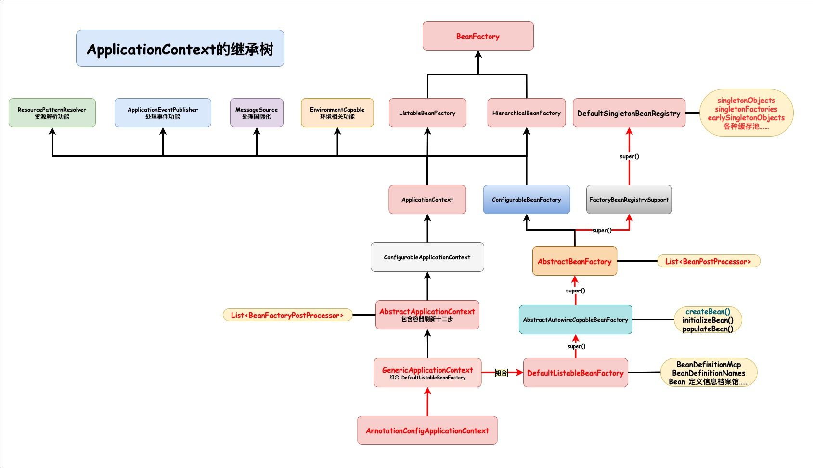
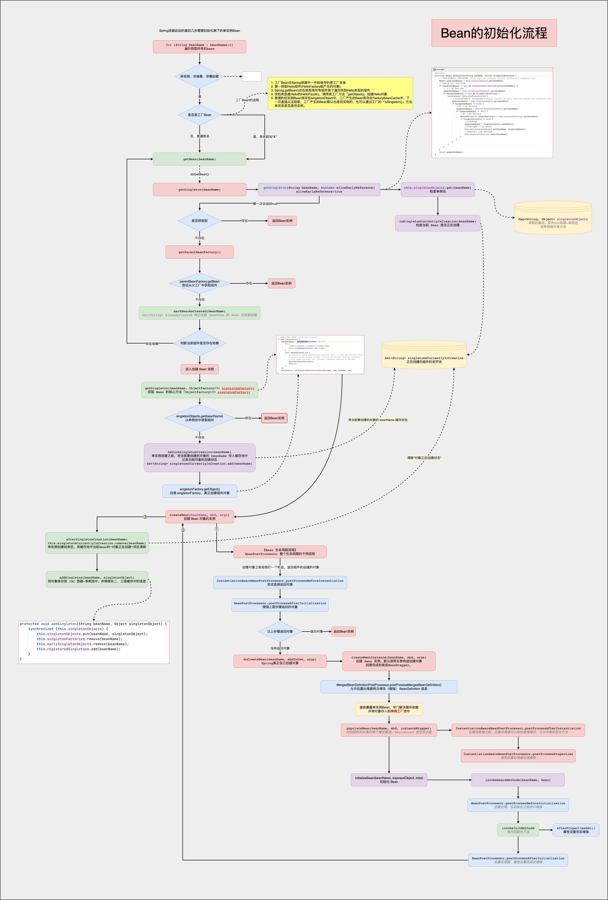
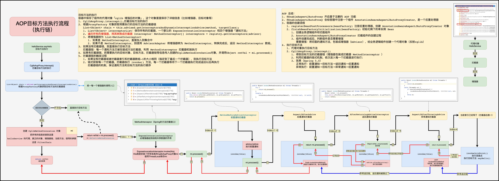

#  Spring Framework

---

## Spring 整体架构


###  Spring 如何工作

Spring 暴露给程序员的使用方式是，要么写一个 xml 文件、要么使用注解、要么利用磁盘文件、网络文件等，把需要的功能定义出来，这个信息最终会生成一个组件或者功能配置清单，Spring 会去读取并解析这些功能清单，这些信息就会决定 Spring 框架中的各种行为。


### Spring 整体架构流程

在 Spring 的底层把所有的资源(xml、注解、网络文件、磁盘文件等)都用 Resource 来表示，Resource 就是 Spring 内部对各种资源的一个抽象，Spring 使用 ResourceLoader(资源加载器)加载这些资源，交给 BeanDefinitionReader 来读取和解析，并存放到 Spring 工厂的 BeanDefinitionRegistry (Bean  定义信息注册中心)中，即 Spring 一启动，就将所有资源解析成 BeanDefinition 存入到 BeanDefinitionRegistry 中(实际是保存在一个 map 中，BeanDefinitionMap)，然后 Spring 将这些 bean 的定义信息挨个创建成对象，并存入到 IOC 容器中，Spring 中使用各种池来存储对象，其中单例对象池用于保存所有的单例对象，在使用对象时，就去单例池中获取对象。


### ApplicationContext 与 BeanFactory 的区别与作用：

1. ApplicationContext 实现了 BeanFactory 接口，所以是 BeanFactory；
2. AnnotationConfigApplicationContext 组合了 DefaultListableBeanFactory，在 AnnotationConfigApplicationContext 执行构造方法时，先通过其父类 GenericApplicationContext 的构造方法创建了 DefaultListableBeanFactory，DefaultListableBeanFactory 及其父类创初始化了用于保存 Bean 定义信息的集合、保存实例的各种池、Bean 定义信息的扫描器和读取器、底层的后置处理器等，然后 AnnotationConfigApplicationContext 再创建 BeanDefinition 的扫描器和读取器，并注册主配置类，最后调用 refresh() 方法刷新容器；
3. DefaultListableBeanFactory 是整个 bean 加载的核心部分，是 Spring 注册及加载 bean 的默认实现；

4. BeanFactory 定义工厂的创建和获取 Bean 的流程，其中包含有用于保存 Bean 定义信息的集合、保存实例的各种池等，因此通常称为 IOC 容器；
5. ApplicationContext 是建立在 BeanFactory 基础之上， 定义了 Bean 的各种增强处理的流程，提供了更多面向应用的功能，更易于创建实际应用，因此通常称为应用上下文；
6. ApplicationContext 里面第一次要用到 bean，会使用工厂 BeanFactory 先来创建，创建好后保存在容器中；
7. ApplicationContext 中管理 bean 的能力是由 BeanFactory 提供支持的，即由 DefaultListableBeanFactory 提供支持的；
8. BeanFactory 是 Spring 框架的基础设施，面向 Spring 本身，ApplicationContext 面向使用 Spring 框架的开发者，几乎所有的应用场景都可以直接使用 ApplicationContext，而非底层的 BeanFactory。


### ApplicationContext的继承树



#### AOP：

1. AnnotationAspectJAutoProxyCreator 后置处理器，会在启动的时候分析所有标注了 @Aspect 注解的切面信息，将其封装成增强器链，并为目标对象创建代理放在容器中；
2. 执行期间代理对象会链式调用 AOP 切面定义的增强方法


#### 生命周期：

1. BeanFactoryPostProcessor：在 BeanFactory 初始化前后拦截；
2. BeanPostProcessor：在所有组件创建对象及初始化前后拦截；
3. InitializingBean：组件单独实现它，可以在组件赋值结束以后调用初始化进行增强处理；
4. SmartInitializingBean：所有组件都创建好以后，每个组件再来 SmartInitializingBean

Bean：保存 BeanDefinition 信息→根据 BeanDefinition 信息创建对象→赋值→初始化；
Bean 的功能增强全都是由 BeanPostProcessor + InitializingBean (合起来)完成的
使用建议：

1. 所有组件可能都会使用的功能，使用后置处理器 BeanPostProcessor 来实现；
2. 单个组件增强的功能，最好使用生命周期 InitializingBean 来实现

组件新功能分析思路：

1. 组件的新功能一般都是由 Bean 的生命周期机制增强出来的；
2. 这个新功能加入了哪些组件，这些组件在生命周期期间做了什么


#### Spring 的套路点：

1. AbstractBeanDefinition 如何给容器中注入了什么组件；
2. BeanFactory 初始化完成后，监控其中多了哪些后置处理器；
3. 分析后置处理器什么时候调用，做了什么功能。

以上所有的前提，是理解容器刷新 12 大步与 getBean() 流程，防止混乱；

1. 工厂后置处理器执行；
2. bean 后置处理器执行、bean 的生命周期（后置处理器 + InitializingBean）


### Spring架构原理图


---

## Spring 容器初始化


### 容器刷新完整流程

Spring 容器启动时，先加载一些底层的后置处理器，例如 ConfigurationClassPostProcessor 配置类后置处理器，容器刷新时，执行工厂后置处理器，注册系统内所有配置类定义信息、AutowiredAnnotationBeanPostProcessor 自动装配功能后置处理器 ……，然后再将由构造传入的所有主配置类的定义信息注册进容器。然后开始刷新容器的步骤，即容器刷新十二大步。

1. **prepareRefresh()**：准备上下文环境；
2. **obtainFreshBeanFactory()**：初始化初级容器 BeanFactory，即工厂的创建，BeanFactory 的第一次创建(有 xml 的解析逻辑)，获取当前准备好的空容器，返回在 this() 环节就准备(new)好的 BeanFactory；
3. **prepareBeanFactory(beanFactory)**：预准备工厂，给容器中注册了环境信息作为单实例 Bean，方便后续自动装配；beanPostProcessor 池中注册了一些后置处理器，例如处理监听功能、XXXAware(感知接口)功能；
4. **postProcessBeanFactory(beanFactory)**：留给子类的模板方法，允许子类继续对工厂执行一些处理(注册一些特殊的后置处理器)；
5. **invokeBeanFactoryPostProcessors(beanFactory)**：工厂的增强或修改：执行所有的 BeanFactory 后置处理器，对工厂进行增强或修改(配置类会在这里解析)，即执行 Spring 容器基本的后置处理。所有的 BeanDefinition 就已经准备就绪了。例如配置类的后置处理器 ConfigurationClassPostProcessor，会在此解析配置类，注册了所有标有 @Component、@ComponentScans、@ImportResource、@PropertySources、@Bean、@Import 等注解的 bean；
6. **registerBeanPostProcessors(beanFactory)**：注册所有的 bean 的后置处理器。例如：注册了创建 AOP 代理的入口 AnnotationAwareAspectJAutoProxyCreator、注册了与注解 @Autowired 相关的 AutowiredAnnotationBeanPostProcessor 等；
7. **initMessageSource()**：初始化消息源 MessageResource。观察容器中是否含有 MessageResource 的定义信息，如果没有就注册一个并放到单例池中；
8. **initApplicationEventMulticaster()**：初始化事件多播器(之后注册的监听器和发布事件都是基于该事件多播器执行的)。判断容器中是否有 id 为 applicationEventMulticaster 的定义信息，如果没有就注册一个事件多播器 ApplicationEventMulticaster 放到单例池中；
9. **onRefresh()**：留给子类继续增强处理逻辑，采用模板模式，用于在实例化 bean 之前，做一些其它初始化 bean 的工作；
10. **registerListeners()**：初始化各种监听器，关联 Spring 的事件监听机制。将容器中所有的监听器 ApplicationListener 保存进多播器集合中；
11. **finishBeanFactoryInitialization(beanFactory)**：初始化所有非懒加载的单实例 bean。详细参照 Bean 的初始化流程，再执行所有后初始化操作，即 SmartInitializingSingleton.afterSingletonsInstantiated；
12. **finishRefresh()**：最后的一些清理、事件发送等处理，即初始化生命周期处理器，并发出相应的事件进行通知。


### 后置处理器


---

## Spring 监听器原理


### 监听器的使用

1. 自定义组件装配 ApplicationContext 或者 ApplicationEventMulticaster， 可以派发事件；
2. 自定义组件实现 ApplicationListener 或者使用注解 @EventListener 标注在方法上，可以接收事件；
3. publish 的 Object 对象会被认为是自定义事件，也可以定义事件(通过实现 ApplicationEvent)。


---

## Bean 的生命周期


### Bean的初始化流程




### Bean生命周期


#### 工厂 Bean 创建对象的步骤：

1. 定义工厂 bean：实现 FactoryBean 接口，并指定 bean 的类型(例如 Hello)，并重写方法 getObject() 和 getObjectType()，getObjectType() 方法的返回值与指定的类型一致，getObject() 方法中定义指定类型的 bean 的创建方法，例如 new Hello()。
2. 从容器中获取指定类型的 bean 实例对象，例如获取 Hello 的实例对象：
    1. 获取可以匹配指定类型的组件名称，遍历容器中所有组件进行筛选
        - 若当前遍历到的组件是工厂 bean，且工厂 bean 中的 getObjectType() 方法的返回值与指定类型相同，则返回此工厂组件名称
        - 若当前组件是普通 bean，则直接返回该组件的名称
    2. 根据组件名称来获取组件实例对象
        - 若组件是工厂 bean，则调用工厂 bean 的 getObject() 方法，获取指定类型的实例对象；
        - 若组件是普通 bean，则调用 spring 获取对象


### 循环引用


### AOP 的循环引用


#### 三级缓存

1. singletonObjects：一级缓存，即 spring 的 ioc 容器，用于存放完整的 bean 实例(已经完成属性赋值和初始化的实例对象)
2. earlySingletonObjects：二级缓存，存放半成品的 bean 实例(尚未被属性赋值和初始化)
    - 如果 bean 被 AOP 切面代理，则其保存的是(未属性赋值的半成品的)bean 实例
    - 如果 bean 不被 AOP 切面代理，则其保存的是代理的 bean 实例--beanProxy，其目标 bean 还是半成品的。
3. singletonObjects：三级缓存，存放的是 ObjectFactory，是一个函数式接口，当执行objectFactory.getObject() 方法时，最终会调用 getEarlyBeanReference(beanName, mbd, bean)，来获取 bean 的早期引用
    - 如果 bean 被 AOP 代理，则其会返回 bean 的代理对象
    - 如果 bean 不被 AOP 代理，则其会返回原 bean 实例对象


#### 循环引用与三级缓存

只使用一级缓存和三级缓存就可以解决(非 AOP 代理类的)循环依赖：一级缓存存放完整 bean、三级缓存存放提前暴露出来的对象工厂(用于创建 bean 的 lambda 表达式)

对于被 AOP 代理的 bean 的循环依赖需使用三级缓存解决：因为三级缓存中的 ObjectFactory 每执行一次就会创建一个对象，此时需要借助另外一个缓存来存放 objectFactory.getObject() 创建的对象，即使用二级缓存来存储其创建的对象，所以，对于被 AOP 代理的 bean 的循环依赖需使用三级缓存解决。


#### 二级缓存存在的问题

1. 生成 A 的实例，然后放入缓存中，A 需要注入属性 B；
2. .生成 B 的实例，B 需要注入属性 A，从缓存中获取 A 并注入到 B 中，并完成 B 的初始化；
3. 将完成初始化后的 B 注入到 A 中，在完成 A 的初始化；
4. 由于 A 是 AOP 的目标类，在其初始化后，后置处理器(AbstractAutoProxyCreator)介入，为 A 生成动态代理类。

A 的最终产物为 A 的代理类，而 B 中注入的属性 A 为原始类，与代理类不是同一个对象，违背了 Spring 的单例原则


#### 为什么要使用二级缓存 earlySingletonObjects？

1. 如果不涉及 AOP 代理，二级缓存就会显得多此一举，但如果使用了 AOP 代理，那么二级缓存就发挥作用了。bean 的 AOP 动态代理对象的创建时在 bean 的初始化之后实现的，但是循环依赖的 bean 就无法等到解决完循环依赖后再创建其代理对象了，因为这个时候需要属性注入，所以如果循环依赖的 bean 被 AOP 代理了，则需要提前创建出代理对象，然后放入到二级缓存中；
2. 三级缓存中存放的是 ObjectFactory 对象工厂，当执行 objectFactory.getObject() 回调时，会调用 getEarlyBeanReference() 方法。获取 bean 的早期引用，每次调用都会产生一个新的代理对象，这有悖于 Spring 的单例设计理念
3. 所以使用二级缓存来缓存 bean 的早期引用，后续步骤可以从二级缓存中获取，就解决了因每次都调用都产生新代理对象的这个问题了，从而保证这个 bean 始终都只有这一个代理对象。


#### 三级缓存解决问题

三级缓存中存储的是 singletonFactories，是某个 beanName 及其对应的 objectFactory，这个 ObjectFactory 其实就是生成这个 Bean 的工厂。
是在给 B 的属性赋值时，需要注入 A，则从三级缓存中取出 A 的缓存数据，即能够生产 A 的 objectFactory，最终回调 getEarlyBeanReference() 方法完成代理对象的创建。

getEarlyBeanReference() 方法具体作用：

1. 根据 beanName 将它对应的实例化后且未初始化的 Bean 存入到 Map<Object, Object> earlyProxyReferences 缓存中，标记当前 Bean 被 AOP 处理过
2. 生成 Bean 对应的代理类并返回

earlyProxyReferences 其实就是用于记录哪些 Bean 被执行过 AOP，防止后期再次对 Bean 进行 AOP 处理。
由于此时的代理对象也是一个尚未初始化的对象，不能被直接使用，不能直接放入到一级缓存中，因此将代理对象存入二级缓存中；
当 A 的属性赋值完成、初始化完成后，此时 A 的代理对象就已经晚上了，便将其存入到一级缓存中

---

## AOP

### 开启 AOP

使用注解 @EnableAspectJAutoProxy 开启基于注解的 AOP 功能，@EnableAspectJAutoProxy 会给容器中导入一个组件 AspectJAutoProxyRegistrar。
Spring 容器刷新执行 invokeBeanFactoryPostProcessors() 方法时，对工厂进行增强，由配置文件解析器 ConfigurationClassPostProcessor 解析 @Import 注解，将组件 AspectJAutoProxyRegistrar 导入到容器中，会为容器中注册了 AnnotationAwareAspectJAutoProxyCreator 的 BeanDefinition。这是一个 bean 的后置处理器，会干预到每个组件的创建环节。

Spring 容器刷新执行 registerBeanPostProcessors() 方法时，注册所有的 bean 的后置处理器，就会为 AnnotationAwareAspectJAutoProxyCreator 创建对象，并在其初始化期间，为其属性中创建并保存了用于利用反射创建增强器的工厂--ReflectiveAspectJAdvisorFactory，同时为其父类属性中创建并保存了 BeanFactoryAspectJAdvisorsBuilderAdapter。由于 AnnotationAwareAspectJAutoProxyCreator 是一个 bean 的后置处理器，就会介入到 bean 的创建过程中。

AnnotationAwareAspectJAutoProxyCreator 是一个 bean 的后置处理器，会干预到每个组件的创建环节。 会利用 postProcessBeforeInstantiation 方法将容器中所有标注了 @Aspect、@Before、@After、@AfterThrowing 等注解解析成 Advisor，Advisor 是一个包含了 Advise 和 pointcut 的增强器。即 Spring 容器在加载配置文件时(一般情况 @EnableAspectJAutoProxy  注解添加在配置文件上)，AnnotationAwareAspectJAutoProxyCreator 会将每一个通知方法都解析成一个 Advisor。


### AOP 增强器的创建

Spring 容器刷新执行 finishBeanFactoryInitialization() 方法时，初始化所有非懒加载的单例 bean，在实例化 bean 之前，后置处理器就会介入，即 AnnotationAwareAspectJAutoProxyCreator 会在 bean 实例化之前执行 postProcessBeforeInstantiation() 方法，会为容器中所有的切面中所有的通知方法创建增强器，即筛所有组件中标注了 @Aspect 注解的切面，为其中的所有通知方法生成增强器 Advisor，排序后存入缓存中，一个增强器 Advisor 即是一个 InstantiationModelAwarePointcutAdvisorImpl 类型的实例对象，其封装了增强方法(通知方法)和切入点等关键信息。


### 创建动态代理

在 bean 的初始化之后，AnnotationAwareAspectJAutoProxyCreator 会再次介入，执行 postProcessAfterInitialization() 方法，判断是否有切面的通知方法切入当前 bean 对象，即当前 bean 对象是切面的目标类，则会为当前 bean 创建动态代理，会根据 bean 是否实现了接口，来区分是使用 JDK 动态代理还是 Cglib 动态代理，代理对象创建完成保存进 ioc 容器。


### 调用代理

调用目标方法时，跳转至代理的回调方法，例如：CglibAopProxy#intercept()，使用代理工厂获取容器中所有的增强器 Advisor，遍历这些 Advisor，与当前目标方法进行匹配，生成增强器链，生成的过程中，将增强器 Advisor 转换成拦截器 Interceptor 类型，最终返回的是拦截器类型的集合，即拦截器链，并缓存到 methodCache 中，将拦截器链封装到 CglibMethodInvocation 中，然后执行 proceed() 方法，执行拦截器链。


### Spring 5.0 通知方法执行顺序

#### 正常执行顺序

1. 前置通知
2. 目标方法
3. 返回通知
4. 后置通知

#### 异常执行顺序

1. 前置通知
2. 目标方法
3. 异常通知
4. 后置通知

```java
try {
	前置通知
	目标方法
	返回通知
} catch (Exception e) {
	异常通知
} finally {
	后置通知
}
```


### AOP创建流程


### AOP执行链执行流程

目标方法的执行，容器中保存了组件的代理对象「cglib 增强后的对象」，这个对象里面保存了详细信息（比如增强器、目标对象等）

1. CglibAopProxy.intercept()，拦截目标方法的执行；
2. 根据 ProxyFactory 对象获取将要执行的目标方法的拦截器链， 
    List<Object> chain = this.advised.getInterceptorsAndDynamicInterceptionAdvice(method, targetClass);
    1. List<Object> interceptorList：保存所有的拦截器，一个默认的 ExposeInvocationInterceptor 和四个增强器，即通知方法；
    2. 遍历所有的增强器，将其转换成 Interceptor：MethodInterceptor[] interceptors = registry.getInterceptors(advisor)；
    3. 将增强器转为 List<MethodInterceptor>；
        1. 如果是 MethodInterceptor ，直接加入到集合中；
        2. 如果不是 MethodInterceptor，则使用 AdvisorAdapter 将增强器转为 MethodInterceptor，转换完成后，返回 MethodInterceptor 数组。
3. 如果没有拦截器链，则直接执行目标方法。「拦截器链：每一个通知方法又被包装成方法拦截器，利用 MethodInterceptor 拦截器机制执行」；
4. 如果有拦截器链，把需要执行的目标对象、目标方法、拦截器链等信息传入创建的CglibMethodInvokation对象，并调用Object retVal = mi.procceed()；
5. 拦截器链的触发过程；
    1. 如果没有拦截器或者拦截器索引和拦截器数组-1的大小相同(指定到了最后一个拦截器)，则执行目标方法；
    2. 链式获取每一个拦截器，拦截器执行 invoke() 方法，每一个拦截器等待下一个拦截器执行完成返回以后再执行。为拦截器链的机制，保证通知方法和目标方法的执行顺序。


### AOP 总结：

1. @EnableAspectJAutoProxy 开启基于注解的 AOP 功能
2. @EnableAspectJAutoProxy 会给容器中注册一个组件 AnnotationAwareAspectJAutoProxyCreator，是一个后置处理器
3. 容器的创建流程
    1. registerBeanPostProcessors(beanFactory) 注册后置处理器，创建 AnnotationAwareAspectJAutoProxyCreator 对象
    2. finishBeanFactoryInitialization(beanFactory) 初始化剩下的单实例 Bean
        1. 创建业务逻辑组件和切面组件
        2. AnnotationAwareAspectJAutoProxyCreator 拦截组件的创建过程
        3. 组件创建完成后，判断组件是否需要增强
            需要增强：将切面的通知方法，包装成增强器 Advisor，给业务逻辑组件创建一个代理对象(反射 cglib)。
4. 执行目标方法
    1. 代理对象执行目标方法
    2. CglibAopProxy.intercept()
        1. 得到目标方法的拦截器链（增强器包装成拦截器 MethodInterceptor ）
        2. 利用拦截器的链式机制，依次进入每一个拦截器进行执行；
        3. Spring 5.0 的效果
            正常执行：前置通知→目标方法→返回通知→后置通知
            异常执行：前置通知→目标方法→异常通知→后置通知



---

## 动态代理

### 动态代理对象的创建时机分为两处：

#### 属性赋值时：

**若当前注入的属性是 AOP 的目标类，且存在循环依赖，则会为这个属性创建 AOP代理对象**

例如：

1. AService 中注入 BService，BService 中注入 AService，且 AService 为 AOP 的目标类，
2. 则在为 AService 的属性赋值时，需要注入 BService，
3. 此时要创建 BService，BService 实例化后，需要为其属性赋值，注入 AService，
4. 而此时 AService 未属性赋值和初始化的早期引用对象位于三级缓存中，其又是 AOP 目标类，需要为其创建 AOP 代理对象，
5. 当执行 objectFactory.getObject() 回调时，最终会调用 getEarlyBeanReference() 方法，来获取 AService 的早期引用对象，
6. 此时 AbstractAutoProxyCreator 会介入，会为其创建 AOP 代理对象，
7. 所以 BService 属性赋值注入的是 AService 的代理对象……

```java
public class AService {
    @Autowired
    private BService bService;
}

public class BService {
    @Autowired
    private AService aService;
}
```


#### 初始化时：

**若当前类是 AOP 目标类，且不存在循环依赖，则会为其创建 AOP 代理对象。**

AService 在初始化之后，后置处理器 AbstractAutoProxyCreator 的后置处理逻辑介入，为其创建 AOP 代理对象。

---

## Spring 事务

---

## MVC 整体架构

---

## MVC启动原理


### MVC启动过程

引入的 spring-web 的类路径 “/spring-web/src/main/resources/META-INF/services/javax.servlet.ServletContainerInitializer” 下指定了 Servlet 规范的实现类“**org.springframework.web.SpringServletContainerInitializer**”，Servlet 规范规定，ServletContainerInitializer 这个接口的实现类负责处理 @HandleTypes 注解，这个接口的所有实现类是由 Tomcat 使用 SPI 机制加载的。

Tomcat 启动时利用 SPI 机制加载，扫描所有实现了 WebApplicationInitializer 接口的实现类，调用这些实现类的 onStartup() 方法完成了下面两件事：

1. 创建了一个空的 IOC 容器，即根容器/父容器，利用根容器创建一个监听器，并保存进 Tomcat 中，容器此时没有刷新；当 Tomcat 加载完 web 应用后，会触发监听器钩子回调 contextInitialized() 方法，来初始化刷新根容器，完成所有的业务逻辑组件功能 AOP、事务、IOC、自动装配、HelloService 创建对象等工作
2. 创建了一个空的 web-ioc 容器，即子容器，利用这个 web-ioc 容器创建 DispatcherServlet 对象，此时 DispatcherServlet 中保存了 web-ioc 容器；DispatcherServlet 继承自 GenericServlet，GenericServlet 有初始化方法 init()，当 Tomcat 加载完 web 应用后，会初始化 DispatcherServlet，即会触发 GenericServlet 子类的初始化模板方法，就会执行 FrameworkServlet 的 initWebApplicationContext() 方法来初始化刷新 web-ioc 容器，期间 web-ioc.setParent(ioc 子容器)，形成父子容器，子容器刷新，此时 Controller 才开始创建对象，并自动装配 Service（如过当前容器中没有，要去父容器中找）。

即 MVC 容器的刷新基于两种方式

1. 监听器回调；

2. 初始化回调。


### MVC 九大组件的初始化

1. 九大核心组件官方介绍：https://docs.spring.io/spring-framework/docs/current/reference/html/web.html#mvc-servlet-special-bean-types
2. 对九大组件进行自定义增强，可以自己实现指定接口，并放在容器中，SpringMVC 就会加载自定义增强的九大组件
3. 九大组件是利用 Spring 的事件驱动完成的。Tomcat 启动 --> 触发 DispatcherServlet 的初始化 --> 初始化全部结束后，容器会发送 Spring 的事件 --> SourceFilterListener 感知到容器准备好了事件 --> 初始化九大组件(底层是 SourceFilterListener，把事件回调到 DispatcherServlet 的 onRefresh 方法)
4. 九大组件，除了文件上传组件，都会有默认值。文件上传功能，需要自己导入相关的jar包并且进行配置。

---

## MVC 请求处理流程


### MVC请求处理流程

1. 用户发送请求至前端控制器 DispatcherServlet；
2. 前端控制器 DispatcherServlet 收到请求，调用处理器映射器 HandlerMapping 查找对应的处理器 Handler，构建出处理器执行链 HandlerExecutionChain 并返回，执行链包含目标方法以及所有的拦截器；
3. 前端控制器 DispatcherServlet 根据处理器执行链，遍历所有的处理器适配器 HandlerAdapter，筛选出能够支持当前处理器的适配器 HandlerAdapter；
4. 处理器适配器 HandlerAdapter 调用处理器 handler，即 Controller 执行目标方法，将返回值封装成模型视图 ModelAndView，并返回给前端控制器 DispatcherServlet；
5. 前端控制器 DispatcherServlet 将模型视图 ModelAndView 传给视图解析器 ViewResolver 进行解析，返回视图对象 View；
6. 前端控制器 DispatcherServlet 调用视图对象 View 进行渲染，即将模型数据填充至视图中，最终由浏览器展示给用户。


### DispatcherServlet 的详细处理步骤

浏览器发起请求，带有应用名称和请求路径，会被 DispatcherServlet 的 doDispatcher() 方法接收并处理；

1. 文件上传预处理；
2. getHandler(processedRequest)：返回 handler 的执行链，包括目标方法和所有的拦截器；
3. getHandlerAdapter()：寻找适配器，HandlerAdapter 是超级反射工具；
4. mappedHandler.applyPreHandle()：拦截器**前置拦截**过程 preHandle；
5. ha.handle()：目标方法执行过程(适配器代为执行)，将返回值封装成模型视图 ModelAndView；
6. mappedHandler.applyPostHandle()：拦截器**后置拦截**过程 postHandle；
7. processDispatchResult(……)：以下都是对封装好的返回值（ModelAndView）的处理环节；
    1. 处理异常(异常解析器)，返回 ModelAndView
    2. render()：渲染 ModelAndView，解析模型与视图，最终决定响应效果


### HandlerExceptionResolver 异常解析器

处理异常(异常解析器)，返回ModelAndView

1. ExceptionHandlerExceptionResolver：处理所有 @ExceptionHandler 注解方式的异常，容器启动扫描所有标注了 @ControllerAdvice 注解的类，以及这个类里面所有标注了 @ExceptionHandler 注解的方法，并缓存这个方法能处理的异常类型；
2. ResponseStatusExceptionResolver：处理标注了 @ResponseStatus 注解的异常；
3. DefaultHandlerExceptionResolver：判断异常是否是 Spring 指定的异常，如果是，直接响应错误页面 sendError 以及错误代码，并返回空的 ModelAndView 对象，new出的空对象。

发生异常，先由 @ExceptionHandler 来处理，如果不能处理，在交由其他的异常解析器处理

- 自定义异常解析器思(实现特定异常时记录日志)参照 ExceptionHandlerExceptionResolver
- 自定义异常解析器 MyExceptionResolver 实现 InitializingBean 接口，在初始化调用 afterPropertiesSet() 方法的时候，分析所有组件上标注了自定义异常解析注解@MyExceptionHandler 的所有方法上，在方法执行的时候记录日志。


### 渲染

render()：渲染 ModelAndView，解析模型与视图，最终决定响应效果

1. resolveViewName()：使用所有视图解析器根据视图名循环解析，将视图模型转化成对应的视图对象
2. view.render()：使用视图对象进行渲染视图


---

## 映射器与适配器的交互


### HandlerMapping 的生命周期

1. DispatcherServlet 创建对象后，Tomcat 调用初始化回调钩子 initServletBean() 方法
2. 最终容器启动完成，Spring 发送事件，回调到 DispatcherServlet 的 onRefresh() 方法
3. onRefresh 初始化九大组件
4. handlerMapping 初始化
    1. 创建所有配置中指定的 HandlerMapping 对象
    2. 启动了 creatBean 来创建 HandlerMapping 的流程
    3. RequestMappingHandlerMapping 对象创建完成后开始了初始化流程
    4. RequestMappingHandlerMapping 实现了 InitializingBean
    5. 调用了 RequestMappingHandlerMapping 的初始化方法 afterPropertiesSet
    6. 拿到 Web 容器，即子容器中的所有组件，挨个遍历，判断是否有 @Controller 或者 @RequestMapping 注解
    7. 把分析到的 RequestMapping 信息注册到 HandlerMapping 的 registry 中


### HandlerMapping：保存了所有 url 的映射关系

1. BeanNameURLHandlerMapping：以 bean 的名字作为URL路径，进行映射
2. RequestMappingHandlerMapping：以 @RequestMapping 注解作为 url 路径，进行映射。默认使用 RequestMappingHandlerMapping，其父类的内部类 MappingRegistry 的 registry 中保存了所有的请求映射信息。
3. RouterFunctionMapping：支持函数式处理以及 webflux 相关功能


### HandleAdapter：超级反射工具

1. HttpRequestHandlerAdapter：判断当前的 Handler 是否是 HttpRequestHandler 的接口
2. SimpleControllerHandlerAdapter：判断当前的 Handler 是否实现了 Controller 接口
3. RequestMappingHandlerAdapter：判断当前的 Handler 是否是 HandlerMethod，只有 RequestMappingHandlerAdapter 能处理复杂方法。


---

## MVC 方法执行流程


### 方法执行流程


---

## @EnableWebMvc 原理


### @EnableWebMvc注解原理

1. @EnableWebMvc 会给容器中导入九大组件，并且还都留有了扩展入口，可以结合 WebMvcConfigurer 接口实现组件自定义。此时容器中含有九大组件
2. DispatcherServlet 在启动的时候是从容器中获取九大组件，并初始化，而不是使用默认(配置文件)的组件初始化。

> @EnableWebMvc 注解引入(Import)了 DelegatingWebMvcConfiguration，而 DelegatingWebMvcConfiguration 继承了 WebMvcConfigurationSupport，WebMvcConfigurationSupport 通过 @Bean 给容器中导入了九大组件，requestMappingHandlerMapping、beanNameHandlerMapping、mvcViewResolver、handlerExceptionResolver……


###  九大组件的导入

九大组件的每一个组件的核心都留给子类模板方法实现父类调用子类重写的方法完成九大组件的导入

1. WebMvcConfigurer + @EnableWebMvc 定制和扩展了 SpringMVC 功能
2. @EnableWebMvc 导入的类 DelegatingWebMvcConfiguration 会给容器中放入 SpringMVC 的很多核心组件
3. 这些组件功能在扩展的时候都是留给接口 **WebMvcConfigurer 的子类**介入并定制的
4. @EnableWebMvc 只开启了 SpringMVC 的基本功能


### SpringMVC 的两种启用方式

1. 使用注解 @EnableWebMvc 开启 SpringMVC 的基本功能，此方式修改了 SpringMVC 底层行为，只需要实现 WebMvcConfigurer 接口，重写方法来配置组件功能。WebMvcConfigurer 预留了 SpringMVC 的扩展接口，可扩展 SpringMVC 的很多功能组件；
2. SpringMVC 默认规则，即所有组件都是在 DispatcherServlet 初始化的时候直接使用配置文件中指定的默认组件。这种方式没有预留扩展接口，如需扩展，则要自己重新替换相应组件；


### WebMvcConfigurer + @EnableWebMvc 实现了定制和扩展 SpringMVC 的功能

- @EnableWebMvc 导入的类 DelegatingWebMvcConfiguration.class 会给容器中放入 SpringMVC 的很多核心组件，例如 HandlerMapping，ViewResolver 等。并且这些组件的功能在扩展的时候都是留给接口 WebMvcConfigurer 介入并定制的(其实现类属于访问者，拿到真正的内容进行修改)，例如 WebMvcConfigurer 的实现类可以配置自定义视图解析器；
- @EnableWebMvc 开启了 MVC 的基本功能，相当于配置文件中的，<mvc:annotation-driven />，即使是以前，也是需要手动配置默认视图解析器的。因此，使用注解版并且自定义视图解析器的时候，要同时将自定义的视图解析器和默认的视图解析器同时注册进容器中。


### DelegatingWebMvcConfiguration 的作用

1. 其父类 WebMvcConfigurationSupport 中含有 @Bean 方法，给容器中放入组件；
2. 每一个组件的核心处都采用了模板方法，留给子类 DelegatingWebMvcConfiguration 来实现；
3. 只要这个 DelegatingWebMvcConfiguration 生效，则从容器中拿到所有的 configurers 完成相应功能，即 WebMvcConfigurer 的实现类完成相应功能；而启用 DelegatingWebMvcConfiguration 有以下几种方式
    1. 任意配置类上加注解 @EnableWebMvc，然后实 WebMvcConfigurer 接口，进行扩展；
    2. 任意配置类继承 DelegatingWebMvcConfiguration，然后实现 WebMvcConfigurer 接口，进行扩展；
    3. 任意配置类继承 WebMvcConfigurationSupport，实现他预留的模板方法进行扩展

