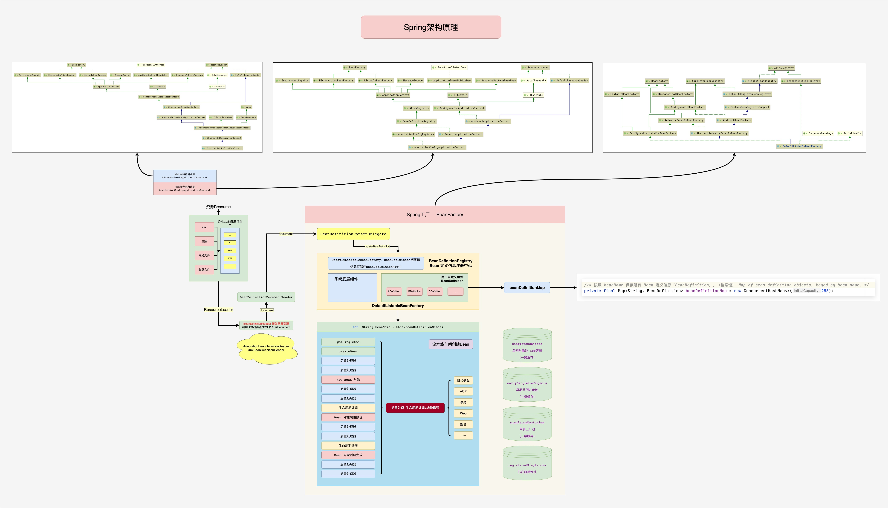
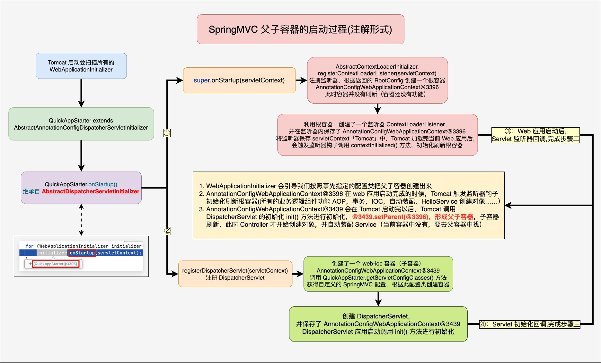

#  Spring Framework  

## Spring 整体架构

Spring 的底层所有资源（xml、注解、网络文件、磁盘文件等）都用 Resource 来表示，Spring 使用 ResourceLoader（资源加载器）加载这些资源，交给 BeanDefinitionReader 来读取，并存放到 Spring 工厂的 BeanDefinitionRegistry （Bean 定义信息注册中心）中，即 Spring 一启动，就将所有资源解析成 BeanDefinition 存入到 BeanDefinitionRegistry 中。（实际是保存在一个 map 中，BeanDefinitionMap），然后 Spring 将定义信息挨个创建成对象，并存入到 IOC 容器中，Spring 中使用各种池来存储对象，其中单例对象池用于保存所有的单例对象，在使用对象时，就去单例池中获取对象。

---
#### Spring架构原理图

---
#### 容器刷新完整流程

---
#### Bean的初始化流程

---
#### Bean生命周期

---
#### 循环引用

---
#### AOP定义阶段

---
#### AOP增强流程

---
#### AOP介入流程

---
#### AOP执行链执行流程

---

MVC 整体架构
---

---
#### MVC启动原理

---
#### MVC启动过程

---
#### MVC请求处理流程

---
#### HandlerMapping与HandlerAdapter的交互

---
#### 方法执行流程

---
#### @EnableWebMvc注解原理

