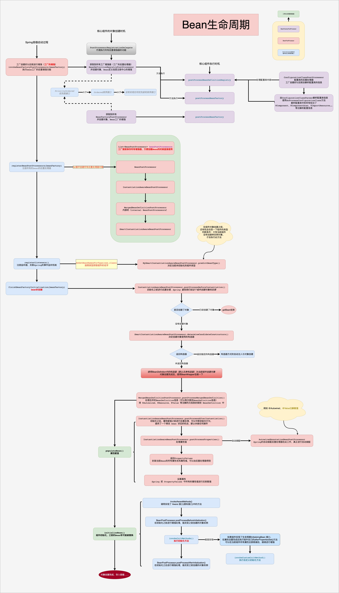

#  Spring Framework 

---

## Spring 整体架构

#### Spring 如何工作
Spring 暴露给程序员的使用方式是，要么写一个 xml 文件、要么使用注解、要么利用磁盘文件、网络文件等，把需要的功能定义出来，这个信息最终会生成一个组件或者功能配置清单，Spring 会去读取并解析这些功能清单，这些信息就会决定 Spring 框架中的各种行为。

#### Spring 整体架构流程
在 Spring 的底层把所有的资源（xml、注解、网络文件、磁盘文件等）都用 Resource 来表示，Spring 使用 ResourceLoader（资源加载器）加载这些资源，交给 BeanDefinitionReader 来读取和解析，并存放到 Spring 工厂的 BeanDefinitionRegistry （Bean  定义信息注册中心）中，即 Spring 一启动，就将所有资源解析成 BeanDefinition 存入到 BeanDefinitionRegistry 中。（实际是保存在一个 map 中，BeanDefinitionMap），然后 Spring 将这些 bean 的定义信息挨个创建成对象，并存入到 IOC 容器中，Spring 中使用各种池来存储对象，其中单例对象池用于保存所有的单例对象，在使用对象时，就去单例池中获取对象。

---
#### Spring架构原理图

---
#### 容器刷新完整流程
Spring 容器启动时，先加载一些底层的后置处理器（例如ConfigurationClassPostProcessor「配置类后置处理器」，容器刷新时，执行工厂后置处理器，注册系统内所有配置类定义信息、AutowiredAnnotationBeanPostProcessor「自动装配功能后置处理器」……），然后再将由构造传入的所有主配置类的定义信息注册进容器。然后开始刷新容器的步骤（容器刷新十二大步）。
1. prepareRefresh()：准备上下文环境；
2. obtainFreshBeanFactory()：工厂的创建，BeanFactory第一次创建「有 xml 的解析逻辑」，获取当前准备好的空容器，返回在 this() 环节就准备（new）好的 BeanFactory；
3. prepareBeanFactory(beanFactory)：预准备工厂，给容器中注册了环境信息作为单实例 Bean，方便后续自动装配；beanPostProcessor 池中注册了一些后置处理器（处理监听功能、XXXAware功能）；
4. postProcessBeanFactory(beanFactory)：留给子类的模板方法，允许子类继续对工厂执行一些处理；
5. invokeBeanFactoryPostProcessors(beanFactory)：工厂的增强或修改：执行所有的 BeanFactory 后置处理器，所有的 BeanDefinition 就已经准备就绪了（配置类会在这里解析，注册了所有标有@Component、@ComponentScans、@ImportResource、@PropertySources、@Bean、@Import等注解的 bean）；
6. registerBeanPostProcessors(beanFactory)：注册所有的 bean 的后置处理器。BeanPostProcessor、ApplicationListenerDetector详细参照 Bean 的生命周期流程；
7. initMessageSource()：初始化，国际化组件。观察容器中是否含有MessageResource的定义信息，如果没有就注册一个放到单例池；
8. initApplicationEventMulticaster()：初始化事件多播功能「事件派发」。观察容器中是否有id为applicationEventMulticaster的定义信息，如果没有就注册一个事件多播器ApplicationEventMulticaster放到单例池中；
9. onRefresh()：留给子类继续增强处理逻辑「模板模式」；
10. registerListeners()：注册监听器，关联Spring的事件监听机制。将容器中所有的监听器 ApplicationListener 保存进多播器集合中；
11. finishBeanFactoryInitialization(beanFactory)：bean的创建，完成BeanFactory的初始化。详细参照Bean的初始化流程，再执行所有后初始化操作「SmartInitializingSingleton.afterSingletonsInstantiated」；
12. finishRefresh()：最后的一些清理、事件发送等处理。

---
#### Bean的初始化流程

---
#### Bean生命周期

---
#### 循环引用

---
#### AOP定义阶段

---
#### AOP增强流程

---
#### AOP介入流程

---
#### AOP执行链执行流程

---

MVC 整体架构
---

---
#### MVC启动原理

---
#### MVC启动过程

---
#### MVC请求处理流程

---
#### HandlerMapping与HandlerAdapter的交互

---
#### 方法执行流程

---
#### @EnableWebMvc注解原理

